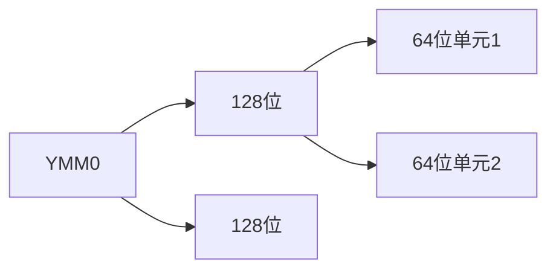
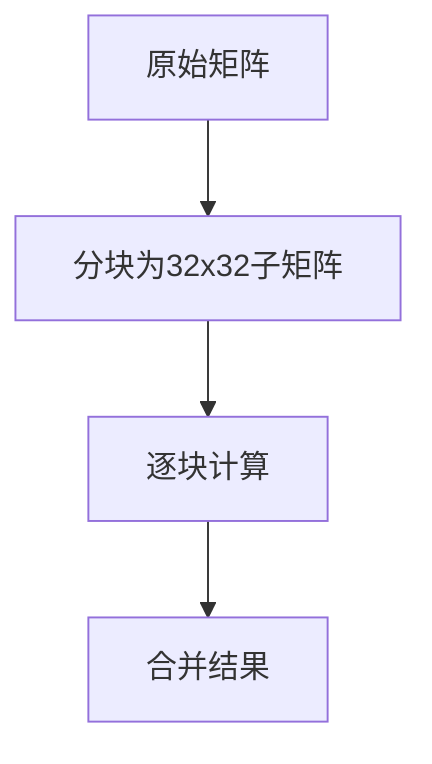

## 目录

1. **并行处理概述**  
2. **SIMD（单指令多数据）**  
    - 概念与 Flynn 分类法  
    - SIMD 应用与实现（以 AVX 为例）  
3. **矩阵乘法优化**  
    - 基础实现与性能分析  
    - SIMD 向量化  
    - 循环展开（Loop Unrolling）  
    - 内存分块（Blocking）  
4. **性能对比与总结**  

---

## 1. 并行处理概述

### 为什么需要并行处理？

- **时钟频率瓶颈**：CPU 主频提升受限，功耗和散热问题显著。
- **并行化是唯一路径**：通过多核、SIMD、多线程等方式提高吞吐量。
- **类比**：航空业通过增加飞机数量（而非单机速度）提升整体运力。

### 并行计算类型（Flynn 分类法）

| 类型       | 指令流 | 数据流 | 示例                 |
| -------- | --- | --- | ------------------ |
| **SISD** | 单指令 | 单数据 | 传统单核处理器            |
| **SIMD** | 单指令 | 多数据 | Intel AVX、GPU 向量指令 |
| **MISD** | 多指令 | 单数据 | 极少应用（如容错系统）        |
| **MIMD** | 多指令 | 多数据 | 多核 CPU、分布式系统       |

---

## 2. SIMD（单指令多数据）


### 核心思想

- **一条指令同时操作多个数据**：例如，一条乘法指令同时对 4 个双精度浮点数进行计算。
- **适用场景**：科学计算、图像处理、深度学习（矩阵运算密集）。

### AVX (Advanced Vector eXtension) 指令集示例

```cpp
// 使用AVX实现4个双精度浮点数的乘法
#include <immintrin.h>

__m256d a = _mm256_load_pd(&A[0]);  // 从内存加载4个double到YMM寄存器
__m256d b = _mm256_load_pd(&B[0]);
__m256d c = _mm256_mul_pd(a, b);    // 并行计算：c[0..3] = a[0..3] * b[0..3]
```

### SIMD 寄存器结构



---

## 3. 矩阵乘法优化

### 基础实现（C 语言）

```c
void dgemm_scalar(int N, double *a, double *b, double *c) {
    for (int i = 0; i < N; i++) {
        for (int j = 0; j < N; j++) {
            double cij = 0;
            for (int k = 0; k < N; k++) {
                cij += a[i + k * N] * b[k + j * N];  // 列主序访问
            }
            c[i + j * N] = cij;
        }
    }
}
```

**性能问题**：标量计算未利用并行性，内存访问模式低效。

---

### SIMD 向量化优化

```c
void dgemm_avx(int N, double *a, double *b, double *c) {
    for (int i = 0; i < N; i += 4) {            // 每次处理4行
        for (int j = 0; j < N; j++) {
            __m256d c0 = _mm256_setzero_pd();   // 初始化累加器为0
            for (int k = 0; k < N; k++) {
                __m256d a_vec = _mm256_load_pd(&a[i + k * N]);  // 加载4个double
                __m256d b_val = _mm256_broadcast_sd(&b[k + j * N]); // 广播单个值到4个位置
                c0 = _mm256_fmadd_pd(a_vec, b_val, c0);       // 乘加指令
            }
            _mm256_store_pd(&c[i + j * N], c0);  // 存储结果
        }
    }
}
```

**优化效果**：理论峰值提升 4 倍（4 个双精度浮点并行计算）。

---

### 循环展开（Loop Unrolling）

**目标**：减少循环开销，增加指令级并行。

```c
// 例如
for (i = 0; i < N; ++i)
    x[i] = x[i] + s;
// 会被展开为
for (i = 0; i < N; i += 4) {
    x[i] = x[i] + s; 
    x[i+1] = x[i+1] + s; 
    x[i+2] = x[i+2] + s;
    x[i+3] = x[i+3] + s;
}
```

**优势**：隐藏流水线延迟，减少分支预测失败。

---

### 内存分块（Blocking）

**目标**：提高缓存命中率，减少 DRAM 访问。



**分块代码示例**：

```c
void dgemm_block(int N, double *A, double *B, double *C) {
    const int BLOCK_SIZE = 32;
    for (int si = 0; si < N; si += BLOCK_SIZE) {
        for (int sj = 0; sj < N; sj += BLOCK_SIZE) {
            for (int sk = 0; sk < N; sk += BLOCK_SIZE) {
                // 计算子块
                do_block(N, si, sj, sk, A, B, C);
            }
        }
    }
}
```

---

## 4. 性能对比与总结

### 优化效果（GFLOPS）

| 矩阵大小 (N) | 标量   | SIMD | SIMD+ 循环展开 | SIMD+ 分块 |     |
| -------- | ---- | ---- | ---------- | -------- | --- |
| 32       | 1.30 | 4.56 | 12.95      | 13.80    |     |
| 960      | 0.91 | 3.64 | 6.91       | 15.82    |     |

### 总结

1. **SIMD**：通过向量指令显著提升计算吞吐量。
2. **循环展开**：减少开销，提高指令级并行。
3. **内存分块**：优化缓存利用率，减少内存墙限制。
4. **综合优化**：组合使用上述技术可接近理论峰值性能。

---

**进一步学习**：  
- MIMD 架构（如多核 CPU、分布式系统）  
- GPU 并行计算（超大规模 SIMT 架构）  
- 现代指令集扩展（如 ARM NEON、RISC-V V 扩展）
