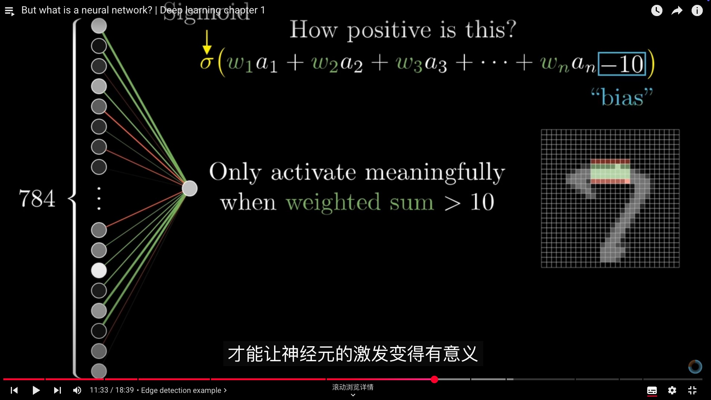

# Neural Network

## MLP(Multilayer Perceptron)

MNIST dataset: write-handed digit recognition

- neurouns: a container holds numbers(0-1), called **activation**
- network: how to setup the neurouns and how to connect them

MLP Example
input layer(784) -- hidden layer 1(16) -- hidden layer 2(16) -- output layer(10)

### How does the layers influence the next layers

How to make the single neurous recognize the specific pattern, such as the horizental line in picture?

- weight attached with the connection from the previous layer to this neorous: which pattern the neurous attentioned
- the weighted sum of the activations from previous layer represented: how close to the specific pattern from the previous layer
- activation function(sigmoid): how positive it is?
- bias: how large the weighted sum need, then activate meaningfully

Learning: find the weight and bias from data

WA
### How does the neural network  trained  